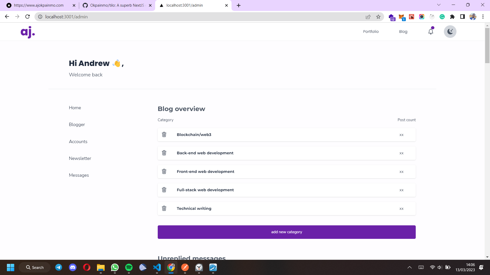
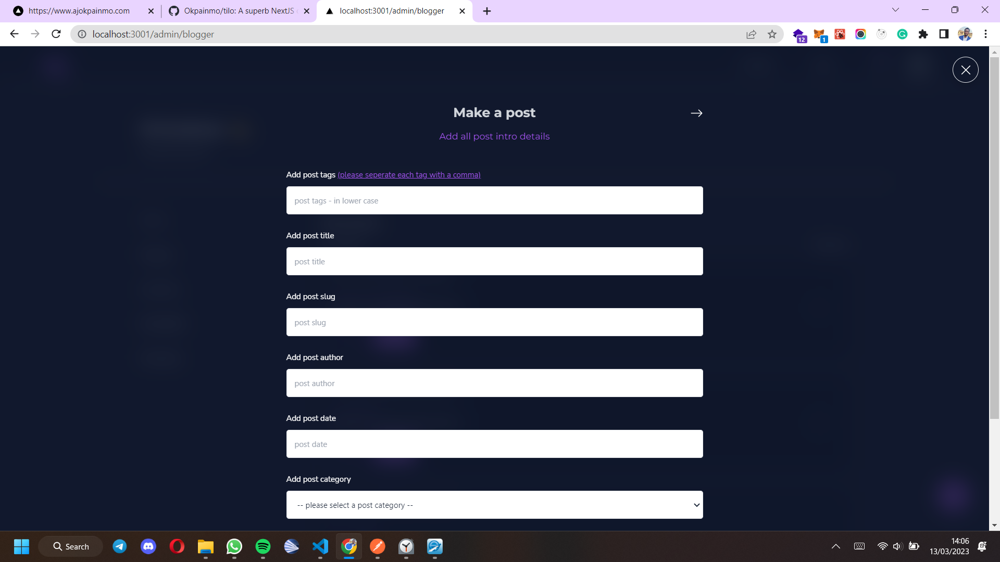
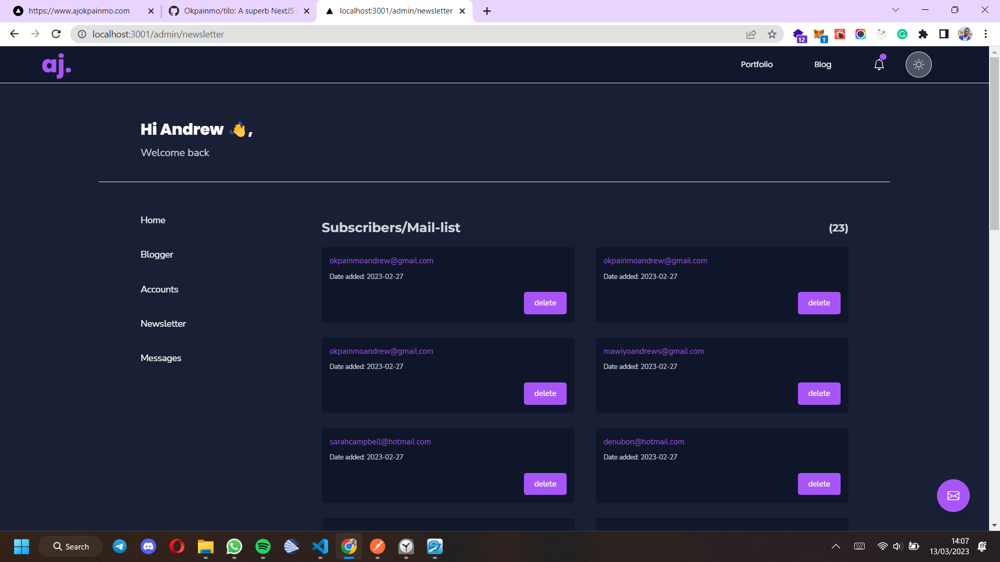
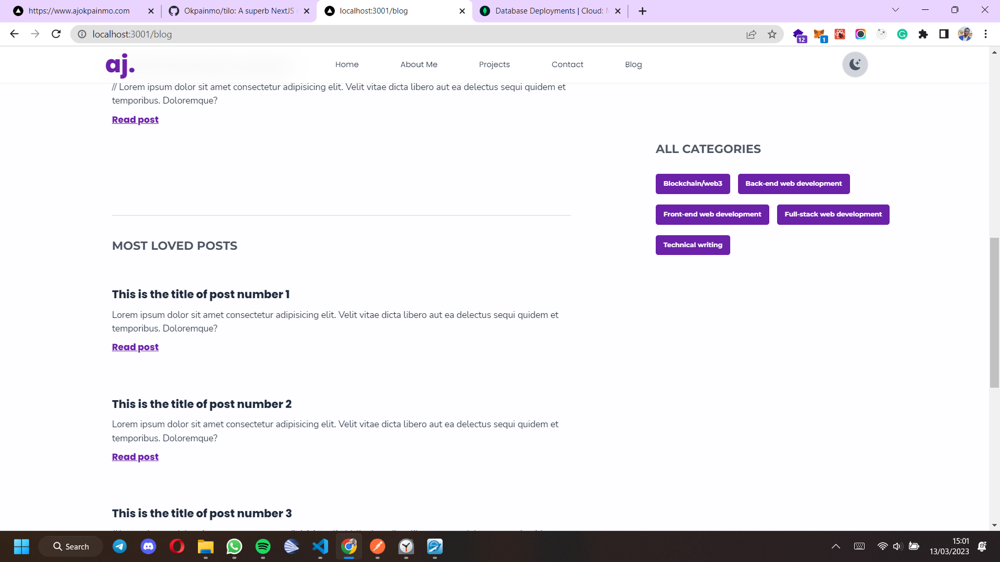
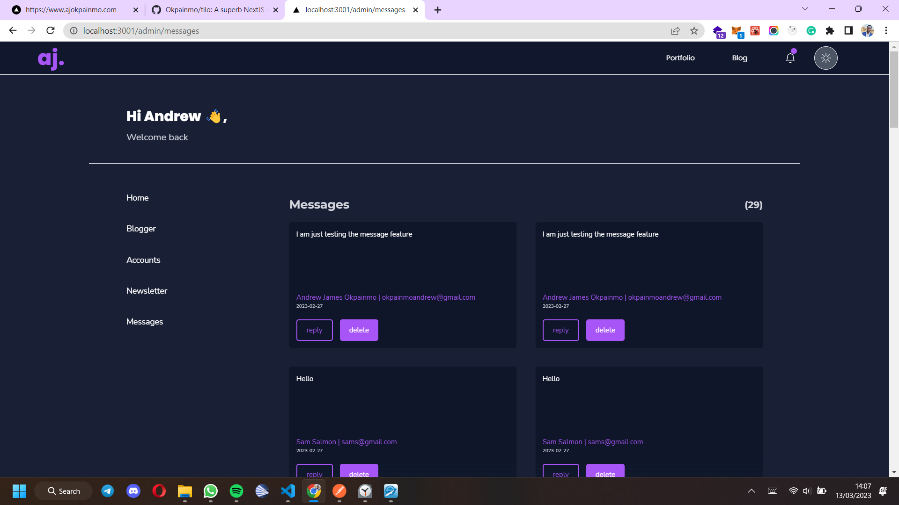
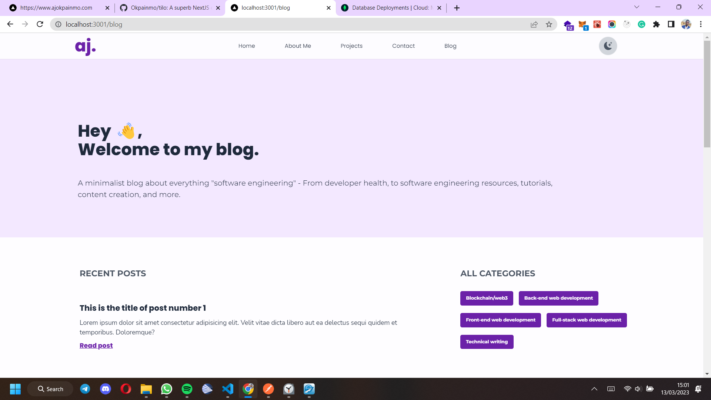
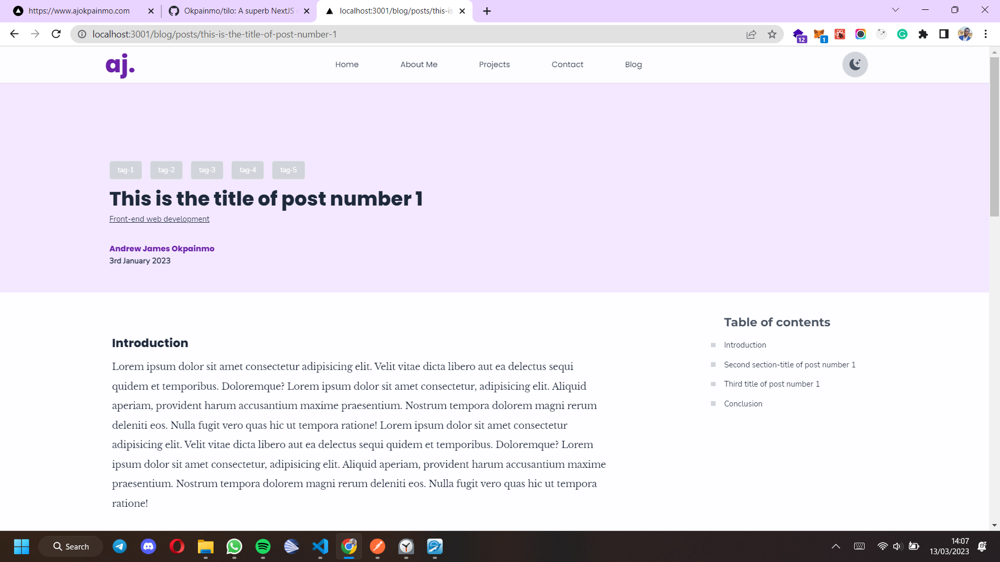
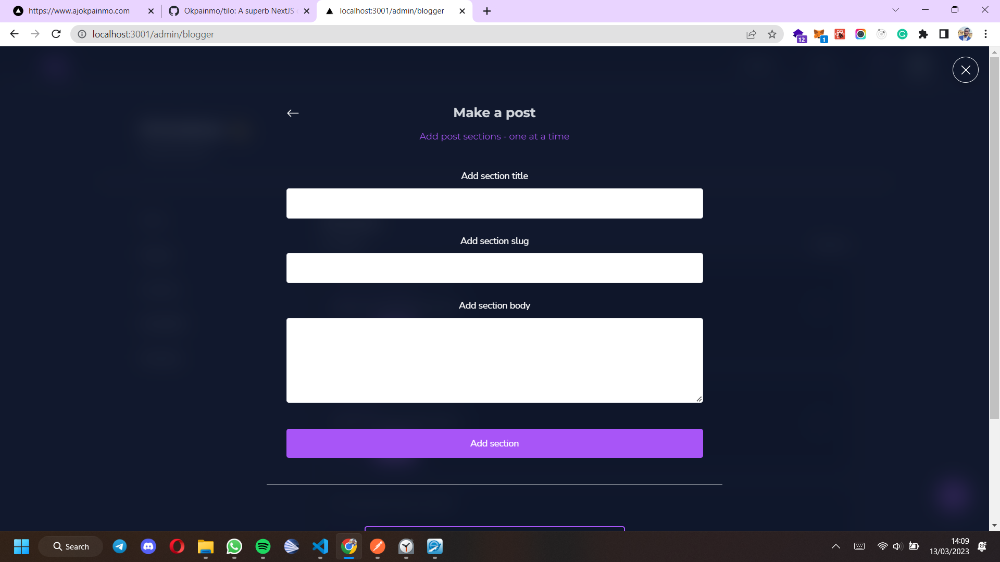
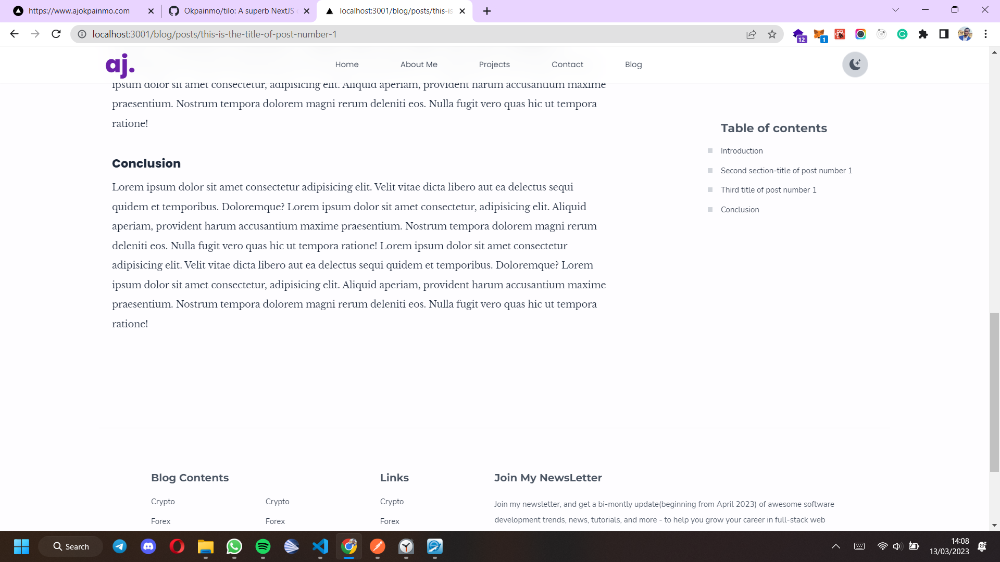

# Chabod_x - still in progress

Chabod_x is a fullstack blog-folio web-app. It is a new and more powerful/advanced version of the [Chabod project](https://github.com/Okpainmo/get_chabod). It's a sleeker and super amazing NextJs/ReactJs + NodeJs Version. I am building it as a brand new blog-folio (portfolio web-app + custom blog + more) project for every interested person - beginning with myself.

The project back-end is built with NodeJs using ExpressJs. Database is MongoDB, and ODM is Mongoose.

> 📢📢📢 Best news is - **It's free to use - but for PERSONAL PORTFOLIOS only. NOT FOR USE IN ANY COMMERCIAL PROJECT**.

This project will help you own a portfolio website which also contains a super-amazing custom blog - **"FOR FREEEEEE!!!"**

> Please note however, that you'll need to add this simple attribution to the base/footer of your own clone.
> "Thanks to chabod-x(link back to the chabod-x repo), and ajokpainmo(link to my website - https://ajokpainmo.com)"

## Features

1. > A complete front-end.
2. > powerful back-end functionalities:
   >
   > - a blog.
   > - a newsletter + mailist.
   > - an admin section for managing the blog, interacting with visitor messages, and for other tasks like sending newsletters/emails.

## Available routes.

> The project is still much in progress. so navigating routes might not be possible. You can try out manual navigation by manually changing the URL in the browser's address bar. Below are the three main available routes.

1. The home(portfolio website) route - https://chabod-x.vercel.app.
2. The project story(case study) page route - https://chabod-x.vercel.app/project-story.
3. The blog route ("/blog") - https://chabod-x.vercel.app/blog.
4. The admin route ("/admin") - https://chabod-x.vercel.app/admin - admin login page coming soon.

## How to use

Simply

- Fork or clone it.
- Host the Back-end.
- Walk around and get to know how to use all of it's awesomeness.
- Tweak it - if you wish.
- Own it - it's yours.

> Please, Don't forget to support the project - Even a gesture as simple as a **star** will mean a lot.
> You can also share your tweaks and share how much unique awesomenes you added to your clone.

Cheers!!! 💗.

## Main Build Stack/Technologies

1. NodeJs/ExpressJs
2. MongoDB + Mongoose
3. NextJs/ReactJs
4. tailwind CSS
5. React Context API
6. Animations/transitions with Framer motion - coming up soon...

## Progress

So far, I've been able to implement the following.

1. Built over 70% of the project User interface - for the portfolio section, the blog, and the admin section.
2. Set up the back-end, and built APIs to handle the implementation of the following:

- Sending messages from the portfolio website.
- Displaying the messages on the admin messages page.
- The newsletter subscription feature.
- Displaying the newsletter subscribers on the admin newsletter page.
- Basic features for adding a blog post.
- Other admin functionalities like the ability to create new post categories, and create new admins - all using NodeJs.

## Live site

> You can find the link to the live project here - **https://chabod-x.vercel.app**.

## Project screenshots.

Below are some awesome screenshots from the progress I've made so far.






















> There's even more. Head to the live site to explore for yourself.

## Setting up for development

Below, are some basic setups to help you set up a local development environment for chabod_x.

### Client/Front-end

1. Open the project root directory with your code editor.

or use the command below.

```

cd chabod_x


```

2. Run the following command to enter into the "client" folder.

```

cd client

```

3. Then run the below command in the "client" folder to install all required dependencies.

```

pnpm install


```

4. When inside the "client" folder (after running the above install command), run the following command to start the app in development mode.

```

pnpm run dev


```

### Server/back-end

1. Open the project root directory with your code editor.

or use the command below.

```

cd chabod_x


```

2. Run the following command to enter into the "server" folder.

```

cd server

```

3. Then run the below command in the "server" folder to install all required dependencies.

```

pnpm install


```

4. When inside the "server" folder (after running the above install command), run the following command to start dev mode.

```

pnpm start


```

> Local development for the back-end is powered by nodemon.

> Please take note that package management in this project is done using PNPM not NPM.

> You might need to do some more setups. If you ever get into any issues, just create a github issue, I'll respond as soon as possible. I'll also be just a twitter DM, a call, or an email way.

- Twitter: https://twitter.com/AJ_Okpainmo

- Email: okpainmoandrew@gmail.com

- Phone: +234 90 5373 9194
